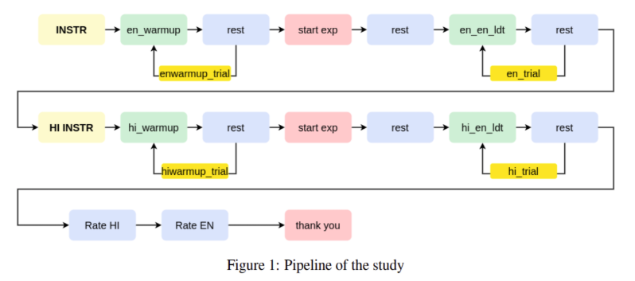
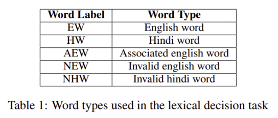
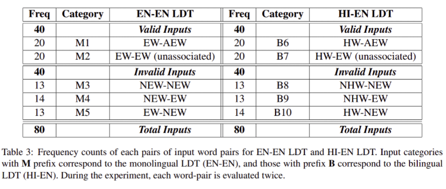
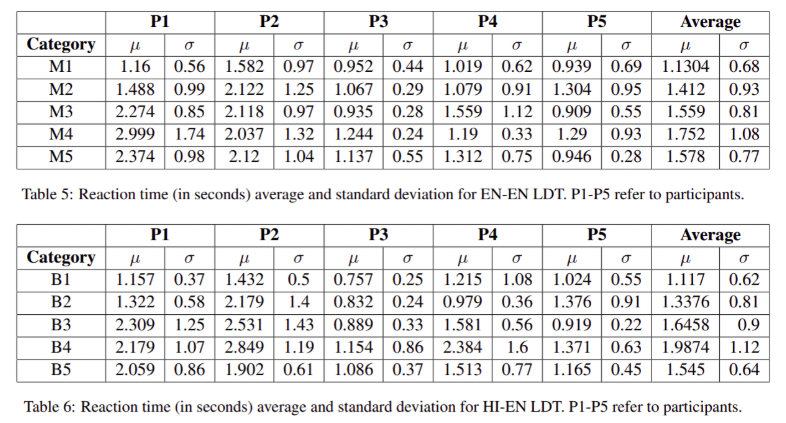

## Effect of Word Priming in Monolingual and Bilingual Lexical Decision Task
 

We replicate the classic word recognition study conducted by Meyer and Schvaneveldt(1971) to understand the process of lexical decision (whether a string is a valid word or not). In addition to this, we also conduct a Hindi-English word priming lexical decision task to investigate if the priming effect can be observed from the first language (L1) to the second language (L2) in bilinguals.

### Experiment Pipeline
 

 

### Input Data
 

 

 

 

### Results
 

 

We observe priming effect in the EN-EN lexical decision task for participants whose second language (L2) was English. This is in support of the spreading activation theory. We observe similar results for the HI-EN task, where exposure to a hindi word leads to smaller reaction time for a word in english. However, we propose experimenting with a larger sample of subjects before concluding this. We also observe highest error rates across all participants when the input category was B9 (i.e. NHW-EW). This means that when the first word is an invalid word, it throws off the participant (or disorients them), leading them to cause more errors in identifying a valid word in language L2. High error rate for the HI-EN task for the B7 category (i.e. HW-EW), could mean that when the pair of words are unrelated and are in languages L1 and L2, it leads to more errors in identification of valid word pairs. This could in turn mean that while the mental lexicon has a shared space for words of similar meaning, the representation in the other language L2 is dormant, and not strong enough to spread activation to other words in L2.