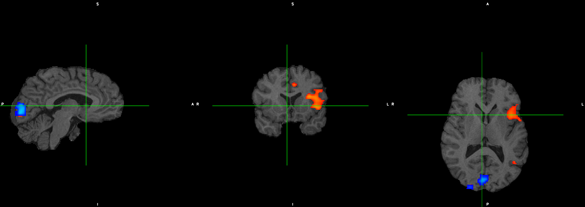
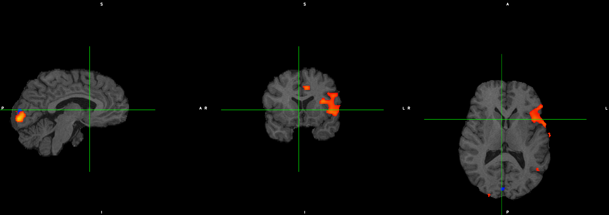
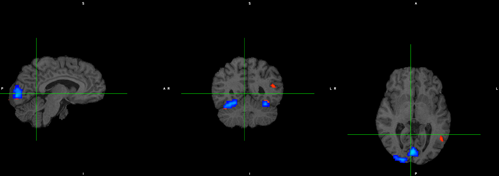
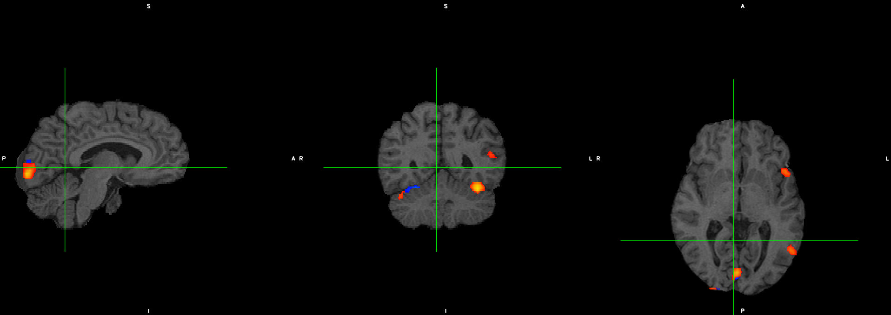

#### Observing difference in activations at the same voxel locations for the two different cost functions

 
Mutual Information for voxel A
 

 
Correlation Ratio for voxel A
 

 
Mutual Information for voxel B
 

 
Correlation Ratio for voxel B
 
