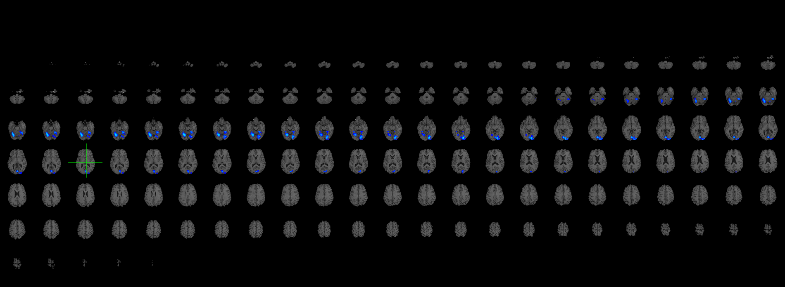

### Threshold activation images
 
Z-threshold = 3.1
 

#### ZStat1 - Word Generation

 

#### ZStat2 - Word Shadowing

 

#### Both Z stats combined

 

 
Motion Correction
 

We observe maximum head movement translation along X axis

 
Time Series Plot for model fit
 

We observe maximum head movement translation along X axis

 
Commands for generation
 

The options available via GUI can be found in the automatically generated report_log.html. For example, we present the commands for mean_func.nii.gz.

